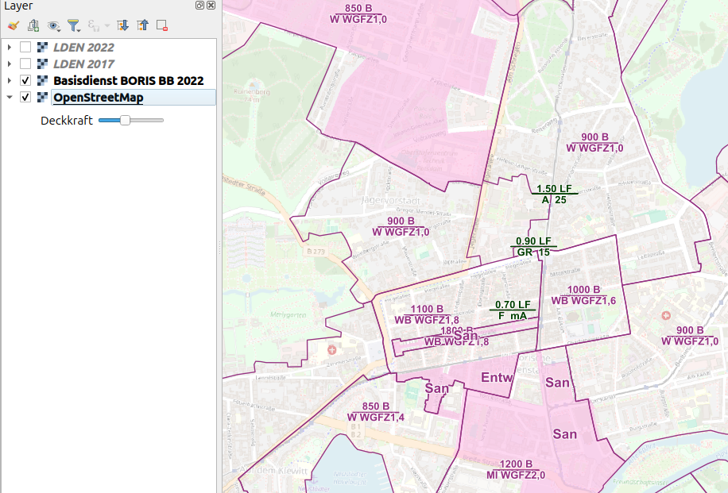
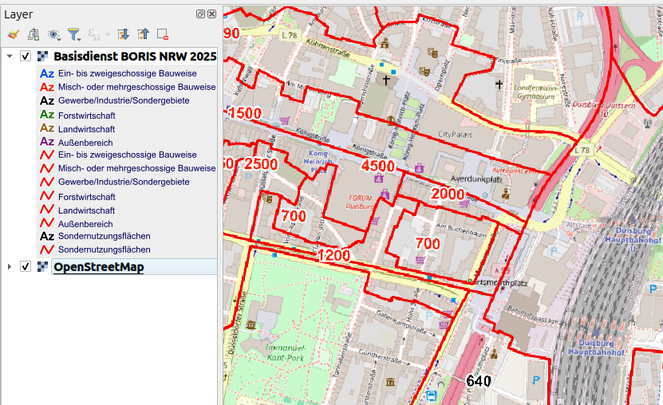

# WMS-Dienste auf Basis von Open Data

Dieses Projekt stellt selbst ausgwählte **WMS-Dienste (Web Map Service)** aus Deutschland bereit. Beispielsweise sind Bodenrichtwerte zu nennen, welche zur Orientierung über den Wert von Grundstücken dienen und in GIS-Anwendungen wie QGIS eingebunden werden können.

## Inhalt

- **Datenquellen:**  
  - Landesvermessung und Geobasisinformation Brandenburg (LGB): https://geobroker.geobasis-bb.de
  - OpenGeodata.NRW: https://www.opengeodata.nrw.de/produkte/geobasis

- **Technische Umsetzung:**
  - Docker mit Docker-Compose
  - Bash-Skripte zur Datenvorbereitung und Automatisierung
  - MapServer Version **8.4.0** als WMS-Server
  - PostgreSQL **17** mit Postgis **3.5**
  - GDAL **3.10**
  - PROJ **9.5**

- **Bereitstellung:**  
  Die Dienste werden über MapServer als WMS-Endpunkt veröffentlicht.

## Voraussetzungen

Um den Dienst selbst zu betreiben, benötigst du:

- Docker
- Shell (Bash)
- Zugriff auf die Bodenrichtwertdaten des LVermGeo Brandenburg

```bash
# Installation des Containers
bash build.sh

# Update Service
docker-compose up db importer
```

## Debugging

```bash
docker logs pg

docker exec -it mapserver tail -f /var/log/apache2/error.log
docker exec -it mapserver tail -f /var/log/mapserver.log

# Testaufruf der Capabilties des BORIS-Dienstes
curl "http://localhost:8081/wms/bb/boris_bb.fcgi?SERVICE=WMS&REQUEST=GetCapabilities"
curl "http://localhost:8081/wms/nrw/boris_nrw.fcgi?SERVICE=WMS&REQUEST=GetCapabilities"
```

## Nutzung als WMS in QGIS

```text
http://localhost:8081/wms/bb/boris_bb.fcgi?
http://localhost:8081/wms/nrw/boris_nrw.fcgi?
```

## 📊 Screenshot's aus QGIS

### BORIS BB 2022



### BORIS NRW 2025

