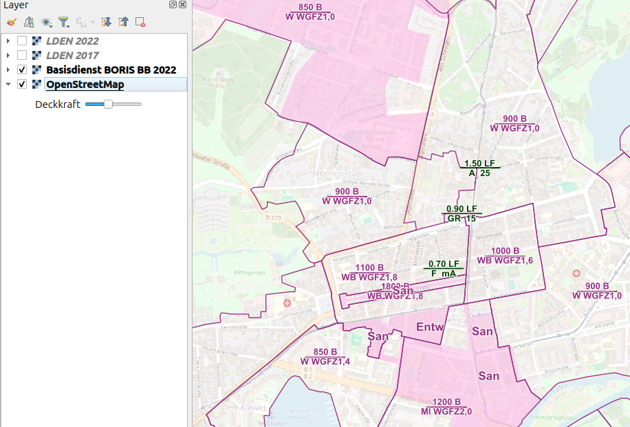
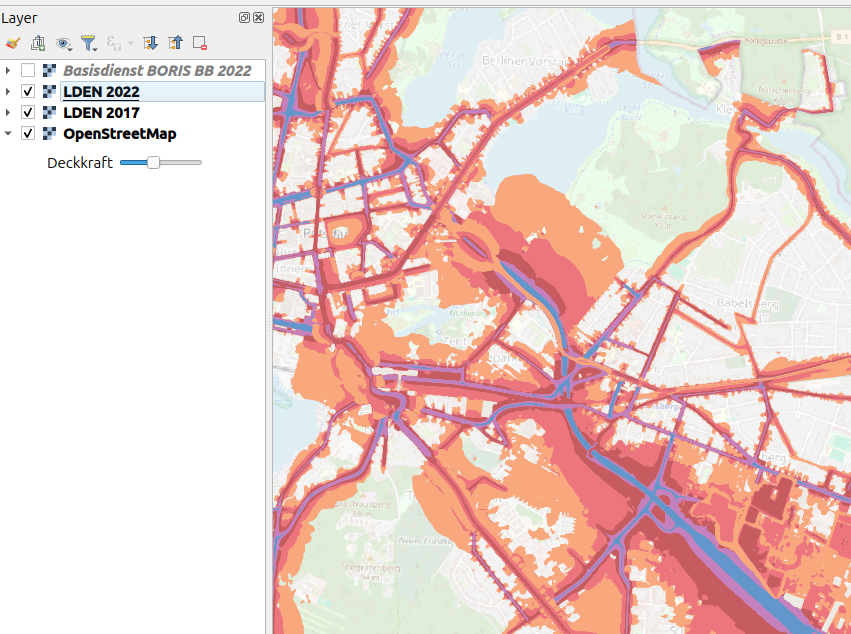
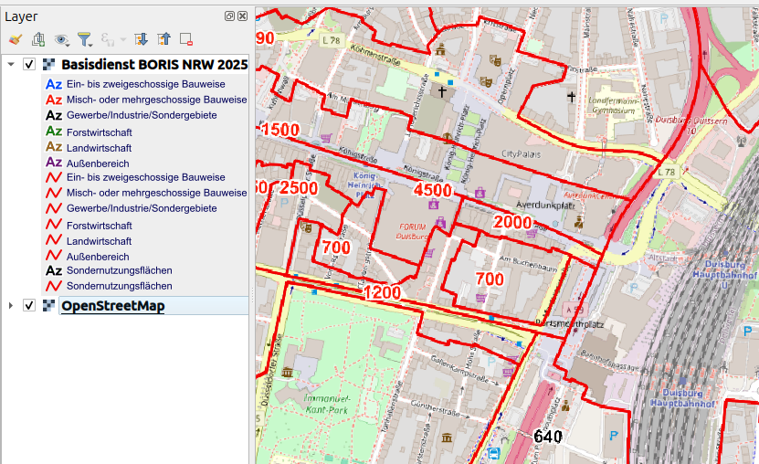
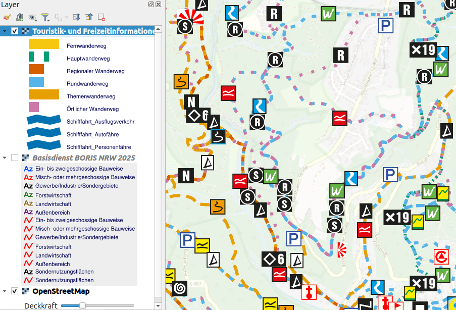

# WMS-Dienste auf Basis von Open Data

Dieses Projekt stellt selbst ausgwählte **WMS-Dienste (Web Map Service)** aus Deutschland bereit. Beispielsweise sind Bodenrichtwerte zu nennen, welche zur Orientierung über den Wert von Grundstücken dienen und in GIS-Anwendungen wie QGIS eingebunden werden können.

## Inhalt

- **Datenquellen:**  
  - Landesvermessung und Geobasisinformation Brandenburg (LGB): https://geobroker.geobasis-bb.de
  - OpenGeodata.NRW: https://www.opengeodata.nrw.de/produkte/geobasis
  - ogc-api.nrw: https://ogc-api.nrw.de/tfis/v1

- **Technische Umsetzung:**
  - Docker mit Docker-Compose
  - Bash-Skripte zur Datenvorbereitung und Automatisierung
  - MapServer Version **8.4.0** als WMS-Server
  - PostgreSQL **17** mit Postgis **3.5**
  - GDAL **3.10**
  - PROJ **9.5**

- **Bereitstellung:**  
  Die Dienste werden über MapServer als WMS-Endpunkt veröffentlicht.

## Voraussetzungen

Um den Dienst selbst zu betreiben, benötigst du:

- Docker
- Shell (Bash)
- Zugriff auf die Bodenrichtwertdaten des LVermGeo Brandenburg

```bash
# Installation des Containers
bash build.sh

# Update Service
docker-compose up db importer
```

## Debugging

```bash
docker logs pg

docker exec -it mapserver tail -f /var/log/apache2/error.log
docker exec -it mapserver tail -f /var/log/mapserver.log

# Testaufruf der Capabilties des BORIS-Dienstes
curl "http://localhost:8081/wms/bb/boris_bb.fcgi?SERVICE=WMS&REQUEST=GetCapabilities"
curl "http://localhost:8081/wms/nrw/boris_nrw.fcgi?SERVICE=WMS&REQUEST=GetCapabilities"
```

## Nutzung als WMS in QGIS

```text
http://localhost:8081/wms/bb/boris_bb.fcgi?
http://localhost:8081/wms/nrw/boris_nrw.fcgi?
```

## 📊 Screenshot's aus QGIS

### BORIS BB 2022



### Umgebungslärm BB 2017 / 2022



### BORIS NRW 2025




### TFIS NRW 2025




# 🗘️ MapServer WMS: `tfis_nrw`

Dieses Repository enthält ein Python-Skript ***mapbox2mapserver.py*** zur **automatischen Erstellung eines MapServer-WMS** für **TFIS NRW** auf Basis von **Mapbox-Sprites** und **GeoJSON-Daten**.

## ✅ Funktionen

- 🎨 Extraktion von Symbolen/Icons aus Mapbox-Sprite-Dateien (`sprite@2x.json`, `sprite@2x.png`)
- 🔄 Konvertierung in MapServer-konforme Layerdefinitionen
- 🧱 Automatische Erstellung von `.map` und `symbols.map`
- 🗘️ Unterstützung für **PostGIS**-basierte Linien- und Punktlayer

---

## 🔧 Voraussetzungen

- Python 3.x
- Pillow: `pip install pillow`
- PostGIS-Datenbank `tfis_nrw`
- Mapbox-Sprite-Dateien:
  - `sprite@2x.png`
  - `sprite@2x.json`
- GeoJSON-Dateien im Verzeichnis `/data/tfis_nrw/`

---

## 📂 Projektstruktur

```
/products/tfis_nrw/build/
├── sprite@2x.json          # Mapbox Sprite JSON
├── sprite@2x.png           # Mapbox Sprite PNG

/data/tfis_nrw/             # GeoJSON-Dateien für die Layer

/etc/mapserver/
├── wms_tfis_nrw.map        # Generiertes Mapfile
├── symbols.map             # Symboldefinitionen
└── icons/                  # Extrahierte PNG-Icons (Pixmaps)
```

---

## 🔁 Konvertierung: Mapbox ➔ MapServer

### 1. 🎨 Symbol- und Icon-Generierung

Mapbox-Sprite-Dateien werden analysiert. Für jedes Symbol wird ein PNG ausgeschnitten und gespeichert:

```python
extract_icons_from_sprite(sprite_json_path, sprite_image_path, output_dir)
```

- Bounding Box aus `sprite@2x.json` wird verwendet
- Unicode-Namen werden Dateisystem-kompatibel (z. B. `ä → ae`, `ß → ss`)
- Ergebnis: PNG-Dateien in `/etc/mapserver/icons/`

---

### 2. 🧠 Symboldefinitionen (`symbols.map`)

Für jedes Icon wird ein Symbolblock erzeugt:

```mapfile
SYMBOL
  NAME "beispiel_symbol"
  TYPE PIXMAP
  IMAGE "icons/beispiel_symbol.png"
END
```

Alle Blöcke landen gesammelt in:

```
/etc/mapserver/symbols.map
```

---

### 3. 🗘️ Mapfile-Struktur (`wms_tfis_nrw.map`)

Aufbau des Mapfiles:

- **MAP\_HEADER**: WMS-Metadaten, Projektion (EPSG:25832)
- **Layerblöcke**:
  - Linienlayer: `wanderwege` (nach `kat` typisiert)
  - Linienlayer: `schifffahrt` (nach `fkt` typisiert)
  - Punktlayer: `freizeiteinrichtungen` (nach `snr` typisiert)
- **Fußbereich**: `END`

Beispiel für einen Punktlayer mit Pixmap-Symbol:

```mapfile
LAYER
  NAME "freizeiteinrichtungen"
  TYPE POINT
  ...
  CLASSITEM "snr"
  CLASS
    EXPRESSION "123"
    STYLE
      SIZE 100
      SYMBOL "123"
    END
  END
END
```

---

## 🛠️ Automatische Generierung

Das Hauptskript übernimmt alle Schritte automatisiert:

```python
if __name__ == "__main__":
    generate_files()
```

Aufruf:

```bash
python3 generate_mapfile.py
```

Dabei geschieht:

- Extraktion der Icons → `icons/*.png`
- Generierung der `symbols.map`
- Analyse und Klassifizierung der GeoJSON-Layer
- Erzeugung der `wms_tfis_nrw.map`

---

## 📄 .gitignore-Hinweis

Wenn du generierte Icons vom Git-Tracking ausschließen willst:

```gitignore
# Nur PNGs im icons-Verzeichnis ignorieren
mapserver/mapfiles/icons/*.png
```

---

## ✅ Ergebnis

Nach Ausführung findest du:

- 🗘️ `wms_tfis_nrw.map` – vollständiges WMS-Mapfile
- 🎨 `symbols.map` – Symboldefinitionen für MapServer
- 🖼️ PNG-Icons im `icons/`-Verzeichnis

---

## 📌 Anwendungszweck

Dieser WMS-Dienst stellt Tourismus- und Freizeitinformationen (TFIS) für NRW dar – ideal für:

- Integration in **OpenLayers**, **QGIS** oder **ArcGIS**
- Darstellung von POIs, Wanderwegen, Schifffahrtsrouten
- WMS-Dienste im Kontext von **INSPIRE** / **OGC**-Standards

## 📌 Datenquellen und Lizenzen

Dieses Projekt verwendet Daten aus folgenden Quellen:

- BORIS-Daten BB:

  - © Gutachterausschüsse für Grundstückswerte 2025, lizenziert unter [Datenlizenz Deutschland – Namensnennung – Version 2.0 (dl-de/by-2-0)](https://www.govdata.de/dl-de/by-2-0), http://www.gutachterausschuss-bb.de

- NRW-Daten:
  - lizenziert unter [Datenlizenz Deutschland – Zero – Version 2.0 (dl-de/zero-2-0)](https://www.govdata.de/dl-de/zero-2-0)

- Umgebungslärm BB:
  ```json
  {
    "id": "dl-by-de/2.0",
    "name": "Datenlizenz Deutschland – Namensnennung – Version 2.0",
    "url": "https://www.govdata.de/dl-de/by-2-0",
    "quelle": "Land Brandenburg; https://inspire.brandenburg.de/services/laerm_wfs?; Lärmkartierung in Brandenburg INSPIRE Download-Service (WFS-LFU-LAERM); 2022 © Landesamt für Umwelt Brandenburg"
  }
  ```

Die Daten unterliegen **nicht** der MIT-Lizenz dieses Repositories. Für deren Nutzung gelten die jeweiligen Bedingungen.
